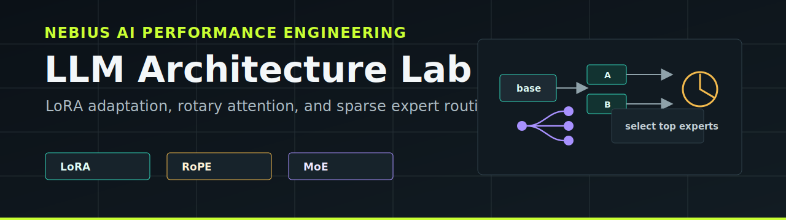

# LLM Architecture Homework 4

This repository wraps two notebook assignments for experimenting with modern language-model adaptation and architecture components.

## Contents

- `lora.ipynb` - implement LoRA from scratch for GPT-2, fine-tune on TinyShakespeare, save/load adapters, and compare with PEFT.
- `tiny_moe_lm.ipynb` - extend a tiny character-level Transformer with RoPE attention and a sparse Mixture-of-Experts feed-forward layer.
- `docs/lora-from-scratch.md` - task explanation, experiment flow, and LoRA method notes.
- `docs/tiny-moe-lm.md` - task explanation, experiment flow, and RoPE/MoE method notes.

## Suggested Workflow

1. Open the notebooks in Jupyter or Colab.
2. Run setup/install cells if the environment does not already have the dependencies.
3. Fill each `TODO` and `# YOUR ANSWER:` section.
4. Run all cells top to bottom.
5. Keep generated samples, metrics, and plots visible in the saved notebooks.

## Runtime Notes

- `lora.ipynb` is designed for a free Colab T4 and uses Hugging Face `transformers`, `datasets`, `peft`, and `accelerate`.
- `tiny_moe_lm.ipynb` is expected to train in about 10 minutes on a Colab T4 GPU. CPU execution works but is much slower.
- Both notebooks use TinyShakespeare as the main dataset.

## Documentation

The docs are intentionally separate from the notebooks so the assignment ideas can be reviewed without running code:

- [LoRA from Scratch](docs/lora-from-scratch.md)
- [Tiny MoE Transformer](docs/tiny-moe-lm.md)

