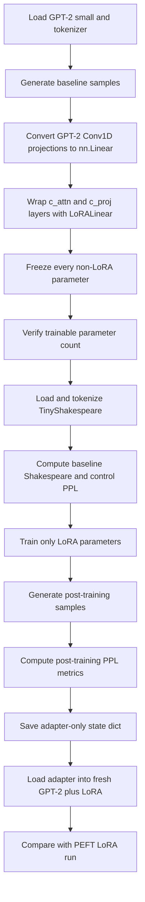
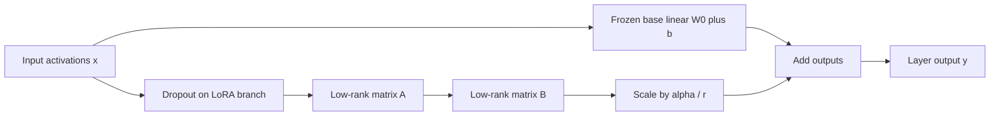

# Task 1: LoRA from Scratch on GPT-2

## Goal

Implement Low-Rank Adaptation (LoRA) manually, inject it into a frozen GPT-2 small model, fine-tune only the adapter weights on TinyShakespeare, and compare the result against the `peft` library.

The assignment emphasizes parameter-efficient fine-tuning: preserve the pretrained model weights, learn small low-rank update matrices, and save only the adapter state.

## Main Deliverables

- Implement `LoRALinear` as a wrapper around `nn.Linear`.
- Convert GPT-2 `Conv1D` projections to `nn.Linear` so the custom wrapper can be applied cleanly.
- Inject LoRA into GPT-2 target modules named `c_attn` and `c_proj`.
- Freeze all non-LoRA parameters and verify only `lora_A` and `lora_B` train.
- Fine-tune on TinyShakespeare and compare generation before and after training.
- Measure Shakespeare validation perplexity and a Pride & Prejudice control perplexity.
- Save and load only adapter weights.
- Repeat the experiment with `peft.LoraConfig` and compare parameter counts and perplexity.

## Main Idea Behind LoRA

LoRA keeps the original linear layer frozen and adds a trainable low-rank residual update:

```text
y = W0 x + b + (alpha / r) * B * A * dropout(x)
```

For a base layer with shape `(d_out, d_in)`:

- `W0` and `b` stay frozen.
- `A` has shape `(r, d_in)` and is initialized with Kaiming uniform.
- `B` has shape `(d_out, r)` and is initialized to zeros.
- The zero initialization of `B` makes the wrapped model match the base model at step 0.
- The rank `r` is much smaller than the full weight dimensions, so the trainable parameter count is tiny compared with full fine-tuning.

At inference, the adapter can remain separate or be merged into the base weight:

```text
W = W0 + (alpha / r) * B * A
```

## Experiment Flow



## Method Flow: LoRA Linear Layer



## What to Watch During the Run

- The initial LoRA-wrapped model should be functionally identical to GPT-2 because `B` starts at zero.
- The target injection should wrap 36 GPT-2 modules: 12 blocks times `c_attn`, `attn.c_proj`, and `mlp.c_proj`.
- The trainable parameter fraction should be around 0.6% to 0.7% of GPT-2 small for `r=8` on the target modules.
- Shakespeare perplexity should drop after fine-tuning.
- Control perplexity may rise. A small rise is expected; a large rise suggests over-specialization or excessive adaptation strength.
- PEFT should produce a comparable adapter setup, though implementation details and target matching can affect exact parameter counts and metrics.

