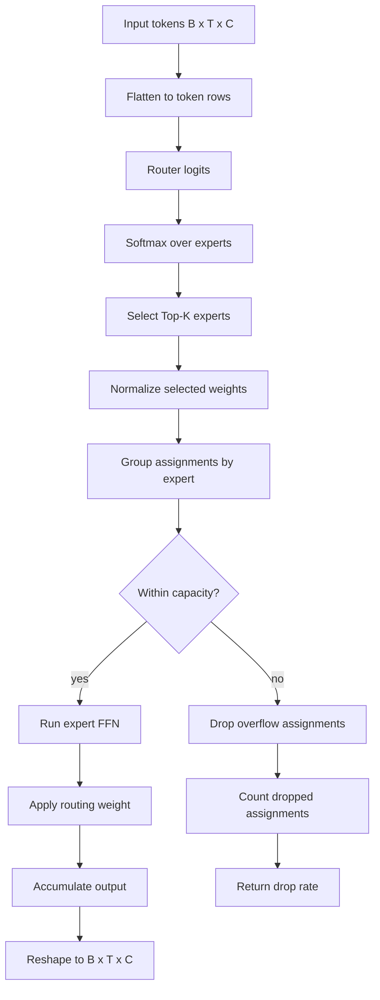

# MoE: Sparse Mixture of Experts

## What We Do

In the tiny Transformer notebook, MoE replaces the usual dense feed-forward network inside each block.

A standard Transformer FFN sends every token through the same MLP. The MoE layer creates several expert MLPs and uses a router to choose only a small number of experts for each token.

The implementation work is:

- Build a router: a linear layer from embedding dimension to number of experts.
- Build an `nn.ModuleList` of expert feed-forward networks.
- Flatten `(batch, sequence, channels)` into token rows for routing.
- Compute router logits, softmax probabilities, and Top-K expert choices.
- Normalize the selected Top-K probabilities so each token's selected weights sum to 1.
- Dispatch tokens to experts.
- Enforce per-expert capacity.
- Drop overflow assignments and report drop rate.
- Accumulate weighted expert outputs back into the original tensor shape.


## Sense of the Method

MoE increases model capacity without making every token pay for every parameter.

The router acts like a learned dispatcher. For each token, it chooses the most relevant expert networks. Only those experts run, so the model can contain more total feed-forward capacity while keeping active compute closer to a smaller dense model.

The key trade-off is routing pressure. If too many tokens choose the same expert, that expert can exceed its capacity. The notebook handles this by truncating overflow assignments and tracking the drop rate.

The core capacity formula is:

```text
capacity = int(total_tokens * top_k / num_experts * capacity_factor)
```

The core drop-rate metric is:

```text
drop_rate = dropped_assignments / (total_tokens * top_k)
```

## Method Flow



## What to Watch

- Top-K weights should sum to 1 for each token after normalization.
- MoE output shape must match the input shape exactly.
- Capacity should be computed from total token assignments, not just batch size.
- Dropped assignments should be counted against `total_tokens * top_k`.
- A high sustained drop rate means the router is overloading experts or capacity is too low.
- Training should keep final drop rate below the assignment target while still reducing validation loss.
