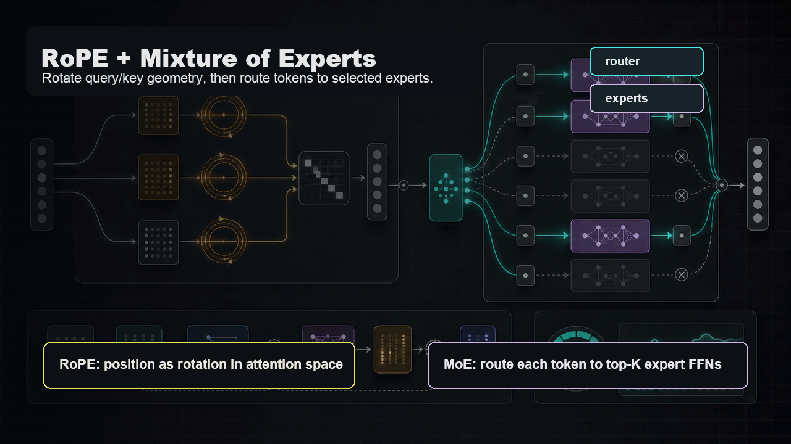
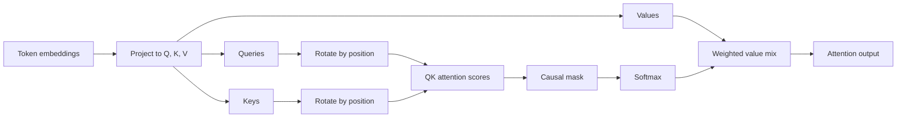

# RoPE: Rotary Position Embeddings

## What We Do

In the tiny Transformer notebook, RoPE replaces learned positional embeddings.

Instead of adding a position vector to token embeddings, we rotate the query and key vectors inside attention. The value vectors are left unchanged. The attention layer still computes dot products, masks future tokens, applies softmax, and mixes values as usual.

The implementation work is:

- Precompute cosine and sine frequency tensors up to `max_seq_len`.
- Store those tensors as non-trainable PyTorch buffers.
- Implement `rotate_half(x)`.
- Slice the cached cosine/sine tensors to the current sequence length.
- Apply RoPE to `q` and `k` before attention scores are computed.
- Remove learned positional embeddings from the full language model.



## Sense of the Method

Attention compares tokens through query-key dot products. If we rotate queries and keys by angles determined by their positions, position becomes part of that comparison.

The intuition is simple: each token gets a position-dependent orientation in attention space. Tokens at different positions point in different rotated directions, so their dot products encode order and relative distance without needing a separate learned position table.

The core operation is:

```text
x_rotated = x * cos(position_frequency) + rotate_half(x) * sin(position_frequency)
```

Where:

```text
rotate_half([x1, x2]) = [-x2, x1]
```

That operation is a real-valued way to rotate pairs of hidden dimensions. The model still learns token embeddings and attention projections, but the positional geometry is fixed and systematic.

## Method Flow



## What to Watch

- RoPE buffers should not require gradients.
- `q` and `k` shapes should not change after rotation.
- The cached cosine/sine tensors must be sliced to the actual sequence length.
- Broadcasting should match `(batch, heads, sequence, head_dim)`.
- The model should no longer use learned positional embeddings.
- Unit tests should confirm shape preservation, deterministic behavior, and no accidental rotation of `v`.
