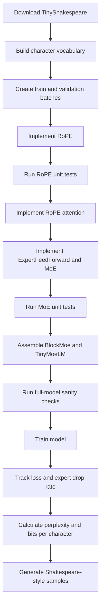
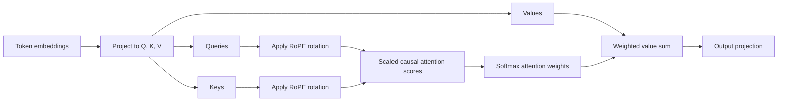
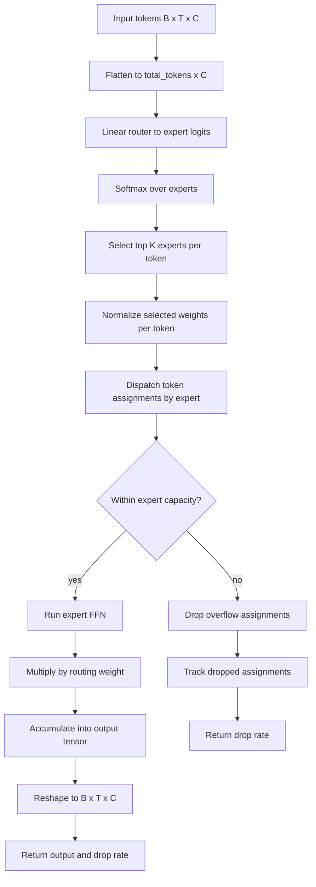

# Task 2: Tiny MoE Transformer with RoPE

## Goal

Extend a tiny character-level Transformer language model by replacing learned positional embeddings with Rotary Position Embeddings (RoPE) and replacing dense feed-forward blocks with a sparse Top-K Mixture-of-Experts (MoE) layer.

The assignment focuses on two architecture ideas used in modern LLMs:

- RoPE for position-aware attention without learned position embedding tables.
- Sparse MoE routing for increasing model capacity while keeping per-token compute bounded.

## Main Deliverables

- Reuse the previous homework's base Transformer components where applicable.
- Implement a `RoPE` module with cached cosine and sine frequencies.
- Implement `MultiHeadSelfAttentionRope` so queries and keys are rotated before attention.
- Implement an `ExpertFeedForward` module based on the dense FFN.
- Implement a Top-K sparse `MoE` layer with router logits, normalized expert weights, expert capacity, token dropping, and drop-rate reporting.
- Implement `BlockMoe` and `TinyMoeLM`.
- Remove learned positional embeddings from the full model.
- Train on TinyShakespeare and verify the target loss and drop-rate behavior.

## Main Idea Behind RoPE

RoPE rotates query and key vectors by a position-dependent angle. Instead of adding a learned position vector to token embeddings, RoPE changes the geometry of attention inputs so relative positions are reflected in dot products.

For each query/key vector `x`, RoPE applies:

```text
x_rotated = x * cos(position_frequency) + rotate_half(x) * sin(position_frequency)
```

Where `rotate_half(x)` splits the last dimension into two halves and returns:

```text
[-x_second_half, x_first_half]
```

The cosine and sine tensors are precomputed up to `max_seq_len` and stored as non-trainable buffers.

## Main Idea Behind MoE

A normal Transformer block sends every token through the same dense feed-forward network. A sparse MoE block uses a router to choose a small number of experts for each token.

In this notebook:

- The router maps token embeddings to expert logits.
- Softmax converts logits to routing probabilities.
- Top-K selection chooses the best `K=2` experts per token.
- The selected weights are renormalized to sum to 1 for each token.
- Each expert processes only the tokens routed to it.
- Expert capacity limits how many assigned tokens each expert can process.
- Excess assignments are dropped and summarized as a drop-rate metric.

The DeepSeek-style fine-grained setup uses more experts with smaller hidden dimensions, increasing routing flexibility while controlling compute.

## Experiment Flow



## Method Flow: RoPE Attention



## Method Flow: Top-K MoE Layer



## What to Watch During the Run

- RoPE buffers should not require gradients and should be sliced dynamically to match the current sequence length.
- Query and key tensors must keep the same shape after rotation.
- MoE output must match the input shape exactly.
- Top-K weights should sum to 1 per token after normalization.
- Expert capacity should be enforced consistently.
- Drop rate above 20% after the first 100 iterations is suspicious; the final target is below 15%.
- Training should reach train loss below about 1.2 and validation loss slightly below about 1.5 on the expected GPU runtime.

