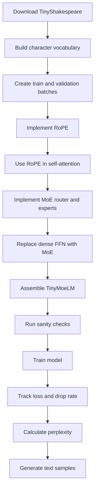

# Task 2: Tiny Transformer with RoPE and MoE

## What We Do

This notebook upgrades a small character-level Transformer language model in two independent ways:

- Replace learned positional embeddings with [Rotary Position Embeddings](rope.md).
- Replace the dense feed-forward network with a [Top-K Mixture-of-Experts layer](moe.md).

The dataset and training loop stay close to the previous tiny Transformer assignment. The main work is in the model internals: attention becomes position-aware through rotation, and the feed-forward block becomes sparse and routed.

## Task Flow

## What to Read Next

- [RoPE](rope.md): what changes in attention, why rotation carries position information, and what to verify.
- [MoE](moe.md): how sparse routing works, why capacity matters, and how to interpret drop rate.

## End Result

The final model should train without `NaN`s, reach the expected validation-loss range, and keep expert drop rate under control. The interesting part is not only the generated Shakespeare-like text, but also whether the architectural changes behave sanely during training.
